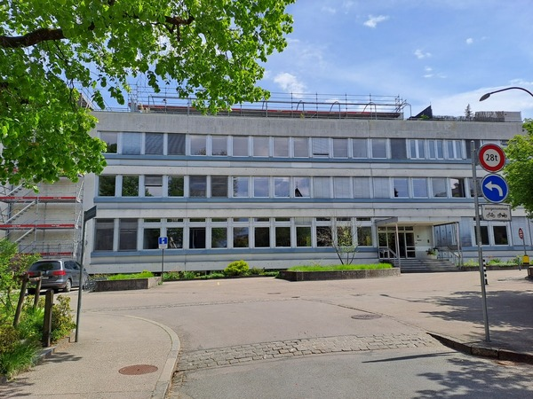
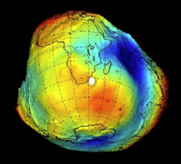
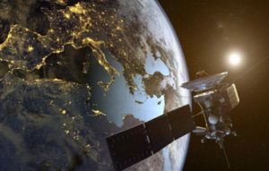

+++
title = "Geodäsie"
date = "2023-05-08"
draft = true
pinned = true
image = ""
+++
### Geodäsie: «die Vermessung der Erde»

Von Silas Mühlethaler

*Geodäsie - Was ist das eigentlich und welche Bedeutung hat diese Wissenschaft für uns? In dieser Reportage werden wir einen Blick auf die Welt der Geodäsie werfen und ihre Anwendungen in verschiedenen Bereichen wie Vermessung, Navigation oder auch Erforschung des Weltalls beleuchten.*

Es ist 15:30 Uhr am Institut für exakte Wissenschaften der Uni Bern. Dr. D. Arnold, der stellvertretende Leiter der Satellitengeodäsie Forschungsabteilung, empfängt mich herzlich. In der Cafeteria, bei einem erfrischenden Glas Wasser, erzählt Herr Arnold zuerst etwas über die Geschichte der Geodäsie, gefolgt von einer spannenden Einführung in die kaum bekannte, doch hochspannende Welt dieser Wissenschaft. Doch was genau ist Geodäsie? 

**Geodäsie**
 Herr Arnold gibt einen interessanten Input zum Thema Geodäsie. Er erklärt, dass die Geodäsie (eine Unterteilung der Geowissenschaften) sich hauptsächlich mit der Vermessung der Erde befasst. Er erzählt, dass die Geodäsie In drei Hauptpfeiler, mit verschiedenen Anwendungen eingeteilt ist.
Die drei Hauptpfeiler sind (in vereinfachter Weise):

1. Die Abmessung der Erde und ihrer Abplattung: «Die Erdabplattung bezeichnet die Abplattung des Planeten Erde, und damit ihre Abweichung von der Kugelform. Sie entsteht durch die Fliehkraft der Erdrotation, welche am Äquator am größten und an den Polen null ist. Dadurch nimmt der Meeresspiegel genähert die Form eines Rotationsellipsoids an». 
   *\-Lexas.de* 
   Die Erdabplattung führt zu einem sogenannten Geoid. Da die Erde nicht genau kugelförmig ist, muss man diese Abweichungen ausmessen und berechnen.

   
2. Die Erdrotation zu messen: Dies ist erforderlich, da die sich Erde nicht von Tag zu Tag und Jahr zu Jahr gleich schnell dreht.
3. Die Erdgravitation auszumessen: «Man muss wissen, dass die Anziehungskraft der Erde nicht überall gleich stark ist, weil es Unterschiede im inneren Aufbau der Erde gibt, aber auch wenn Prozesse, die auf der Erde Stadt finden.» Die Gravitation der Erde kann wegen Prozessen, wie zum Beispiel einer Flut, variieren. Einen anderen Einfluss hat die Dichte des Bodens, zum Beispiel schwankt die Höhe des Meeresspiegels deswegen (sieht man auf dem Bild 1).
   Eine Anwendung der Geodäsie ist die Landvermessung. Geodäten verwenden modernste Technologien wie GPS, Satelliten und Laservermessung, um präzise Messungen vorzunehmen. Diese Messungen werden täglich verwendet, ohne dass wir dies wirklich merken. Zum Beispiel für die Kartographie, um digitale Modelle der Erde und ihrer Oberfläche zu erstellen. Sie ist vielen Bereichen unverzichtbar, wie bei der Stadtplanung oder dem Bau von Infrastruktur. 
   Ein weiteres wichtiges Anwendungsgebiet der Geodäsie ist die Navigation. GPS-Systeme verwenden 24 Satelliten die in rund 20’200m Höhe elliptisch die Erde umrunden, um genaue Positionen auf der Erdoberfläche zu bestimmen. Die Informationen, die von diesen Satelliten gesendet werden, ermöglichen es den Nutzern, sich zu orientieren, sei es in einer neuen Stadt oder auf der Suche des nächsten Supermarkts. Natürlich wird das GPS weltweit von jedem mit einem Handy benutzt, dies leider nicht nur in friedlichen Zwecken. 
   Danach erläutert Herr Arnold, dass die Geodäsie auch von großer Bedeutung für die Erforschung des Weltraums ist. Geodäten verwenden Satelliten, um die Erde und andere Himmelskörper zu verfolgen und zu vermessen. Diese Messungen ermöglichen es uns, unsere Kenntnisse über das Universum zu vergrössern und mehr über den Ursprung und die Entwicklung unseres Planeten zu erfahren. Bemerkenswert ist es, dass wir unseren Mond viel besser kennen als die Erde selbst. Doktor Arnold sagt, dass dies wegen der tiefen Erdgravitation gelingt.
   Danach entwickelt sich das Gespräch in Richtung seiner Spezialisation der Satellitengeodäsie
   **Satellitengeodäsie** 

   

   Nach der Erklärung der Geodäsie, fing Dr. Arnold von seinem jetzigen Job an zu sprechen, der Satellitengeodäsie. Die um 1958 entstandene Satellitengestützte Geodäsie, kurz Satellitengeodäsie genannt, ist eine Technologie, die die Erde und ihre Oberfläche aus dem Weltall vermisst. Es handelt sich um eine Methode der Geodäsie, die auf der Verwendung von Satelliten und ihren Signalen basiert. Sie ist für die genauen Messungen der Größe, Form und Position der Erde zuständig. Diese Technologie hat viele Anwendungsbereiche, einschließlich der Vermessung von Land, der Überwachung von Naturkatastrophen und der Verbesserung von Navigationssystemen (GPS).
   Die Satellitengestützte Geodäsie nutzt Satelliten, die elliptisch um die Erde kreisen. Diese Satelliten senden Signale an Empfänger auf der Erde, die die Signale aufzeichnen und analysieren können. Die Empfänger messen die Zeit, die benötigt wird, um das Signal zu empfangen, und berechnen die Entfernung zwischen dem Satelliten und dem Empfänger. Die Daten, die von diesen Satelliten und Empfängern gesammelt werden, werden verwendet, um die genauen Koordinaten des Empfängers auf der Erdoberfläche zu berechnen und um genaue Messungen der Größe, Form und Position der Erde zu erhalten. 
   Eine Anwendung der Satellitengestützten Geodäsie ist die Vermessung von Land. Diese Technologie wird oft verwendet, um Landkarten zu erstellen und Landvermessungen durchzuführen. Durch den Gebrauch von Satelliten können genaue Messungen der Höhe, Breite und Tiefe von Land gemacht werden, um detaillierte Karten zu erstellen.
   Eine andere Methode der Satellitengestützten Geodäsie ist die Radar-Interferometrie, bei der Radarsignale von Satelliten auf die Erde gesendet werden. Die Signale werden von der Erdoberfläche reflektiert und von den Satelliten empfangen. Durch die Analyse der zurückgeworfenen Signale können Änderungen der Erdoberfläche wie Verschiebungen von Landmassen oder der Ablauf von Gletschern ermittelt werden. 
   Eine weitere Anwendung ist die Überwachung von Naturkatastrophen. Diese Technologie kann verwendet werden, um Erdbeben, Überschwemmungen, Vulkanausbrüche und Tsunamis zu verfolgen und zu messen. Dank dieser frühzeitigen Erkennung kann man präzise Voraussagen erstellen und Menschen frühzeitig warnen und evakuieren.
   Schließlich kann die Satellitengestützte Geodäsie auch verwendet werden, um Navigationssysteme zu verbessern. Satellitengestützte Navigationssysteme wie GPS verwenden Satelliten, um genaue Positionsdaten bereitzustellen. Durch die Verwendung von Satellitendaten können Navigationssysteme genauere und zuverlässigere Informationen bereitstellen.
   **Bernese**
   Die gesamten satellitengeodätischen Auswertungen werden mittels einer Software, die in Bern kreiert worden ist und daher auch diesen Namen hat, verarbeitet. «Das ist unser Kind hier und wir sind stolz darauf», sagte Herr Arnold. Diese Software heisst Bernese und mehr dazu erklärt Dr. Martin Lasser. Diese Software wird grundsätzlich erstens für die Bestimmung der Satelliten Bahnen (insbesondere GPS) gebraucht, zweitens für die Bestimmung der Stationskoordinaten. Das ist kompliziert, die Station selbst bewegt sich zum Beispiel wegen der Plattenbewegungen. Dank dieser Software fällt es Geodäten einfacher, die gesammelten Daten zu verwerten. 
   Insgesamt ist die satellitengestützte Geodäsie eine wichtige Technologie, die viele verschiedene Anwendungsbereiche hat. Durch die Verwendung von Satelliten können genaue Messungen der Größe, Form und Position der Erde gemacht werden, was bei der Vermessung von Land, der Überwachung von Naturkatastrophen und der Verbesserung von Navigationssystemen helfen kann. Man kann auch andere Himmelskörper ausmessen wie zum Beispiel unseren Mond.
   **Zukunft**
   Als letztes Gesprächsthema wurde die Zukunft und Automatisierung angesprochen. Dr. Arnold erzählt, dass er nicht sehr besorgt ist, seinen Job in naher Zukunft zu verlieren. Er denkt, dass man die KI (künstliche Intelligenz) in Zukunft brauchen wird, um einfache und langweilige Teile der Arbeit zu erledigen. Die KI ist aber in den nächsten paar Jahren der Arbeit der Geodäten noch nicht gewachsen. Ein Geodät muss nämlich immer in der Lage sein, seine Resultate nachvollziehbar zu präsentieren,  denn - wie Herr Arnold sagt - «Reproduzierbarkeit ist das A und O der Wissenschaft»\
   Insgesamt ist die Geodäsie eine sehr hilfreiche Disziplin, die mehr Aufmerksamkeit verdient.  Sie hilft uns, die Welt um uns herum besser zu verstehen, und uns in ihr zurecht zu finden, doch es geht auch weit darüber hinaus.

**Geschichte**

   Geodäsie spielt nachgewiesenerweise das erste Mal bei den alten Ägyptern eine grosse Rolle. Sie wird zuerst zur Einteilung von Grundstücken und Äckern benutzt. Seit jeher spielt Geodäsie eine sehr wichtige Rolle im Alltag der Menschheit, ohne dass uns dies wirklich bewusst ist.
   Einen Meilenstein der Geodäsie erreicht Eratosthenes, ein brillanter griechischer Gelehrter, der im 3. Jahrhundert v. Chr. lebte. Er war ein Universalgelehrter und arbeitete in verschiedenen Bereichen wie Mathematik, Geografie, Astronomie und Literatur. Er gilt als einer der bedeutendsten Gelehrten des hellenistischen Zeitalters. Er war die erste Person, die den Erdumfang präzise berechnet hat. Seiner Berechnung nach misst der Erdumfang rund 39'325 km. Heutzutage weiss man dank moderner Technik, dass der Erdumfang 40'075km beträgt.
   Später prägt die Geodäsie stark die Kartographie, dank der unzählige Karten erstellt wurden, die bis heute benutzt und verbessert werden. Auf jedem Handy haben wir auf Knopfdruck mit «Google Maps» eine detaillierte Weltkarte mit Navigationssystem, eine enorme Errungenschaft der Geodäsie und der modernen Technik.
   Um 1960 wurde der erste geodätische Satellit ins All befördert. Dank diesem konnte man das erste Mal dank höchst präzisen Berechnungen der erfassten Daten die Erde vermessen.

